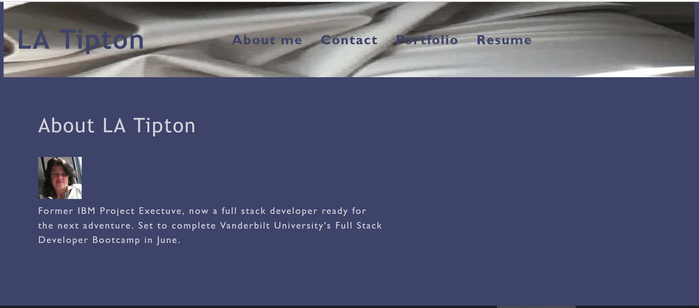

# **Personal Portfolio**
  
## **The Repository**
#### GitHub: https://github.com/loriful/portfolio

## **Deployment**
#### https://loriful.github.io/portfolio

## **Description**
Personal portfolio built with MERN stack

Practice: 
  - JavaScript
  - JSX
  - MongoDB
  - Express
  - React - Single-page app with reusable UI components, state, propos, and hooks
  - Node
  - Jest

  <!-- - IndexDB API
  - Progressive Web Applications
  - Manifest.json
  - Service workers -->

## **Table of Contents**
- [Description](#description)
- [Installation](#installation)
- [Usage](#usage)
- [Questions](#questions)

## **The Site View**

  
  </b>
  </b>

## **Installation**
- Requires Node and MongoDB, and npm packages Express and Mongoose
- Run <npm install> from root

## **Usage**
- Launch from browser at above link

## **Questions**
### Github Profile:  https://github.com/loriful

### You may contact tiptonica@gmail.com with any questions related to this repository.